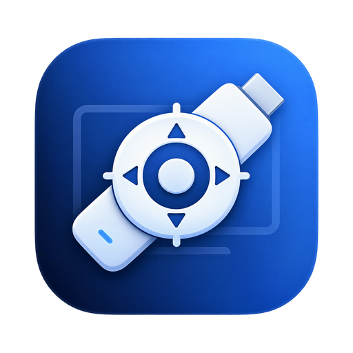
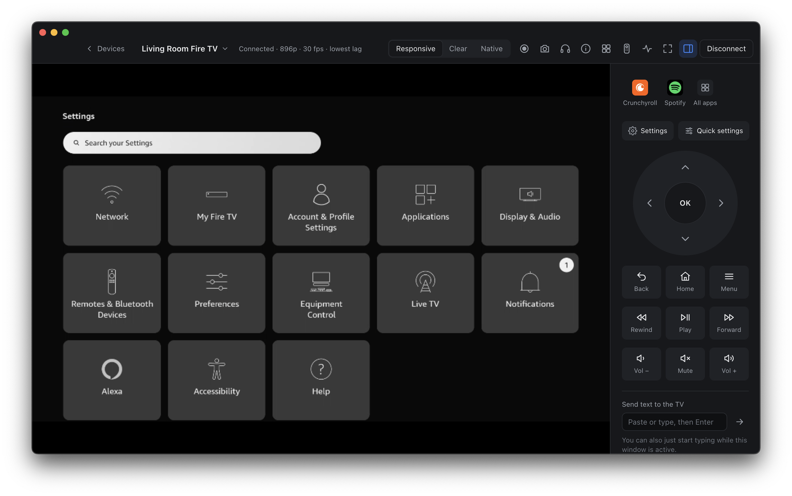
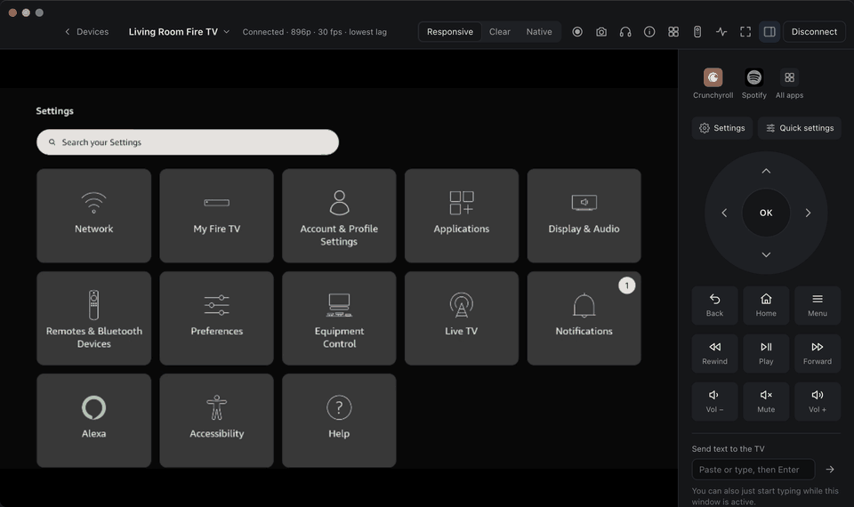
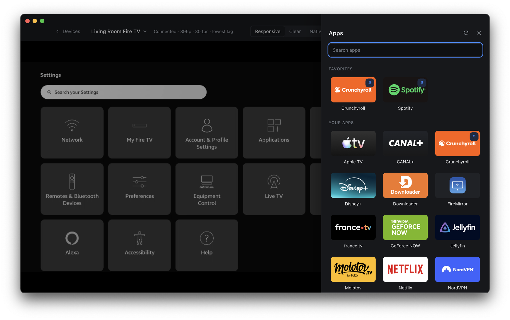
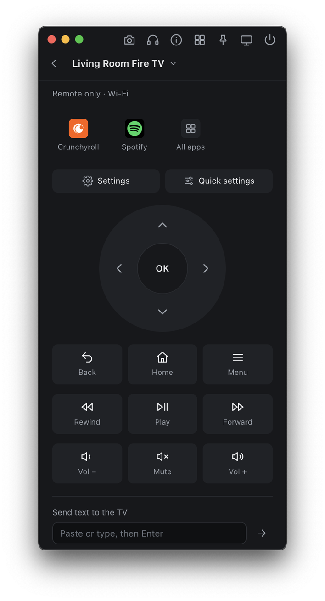
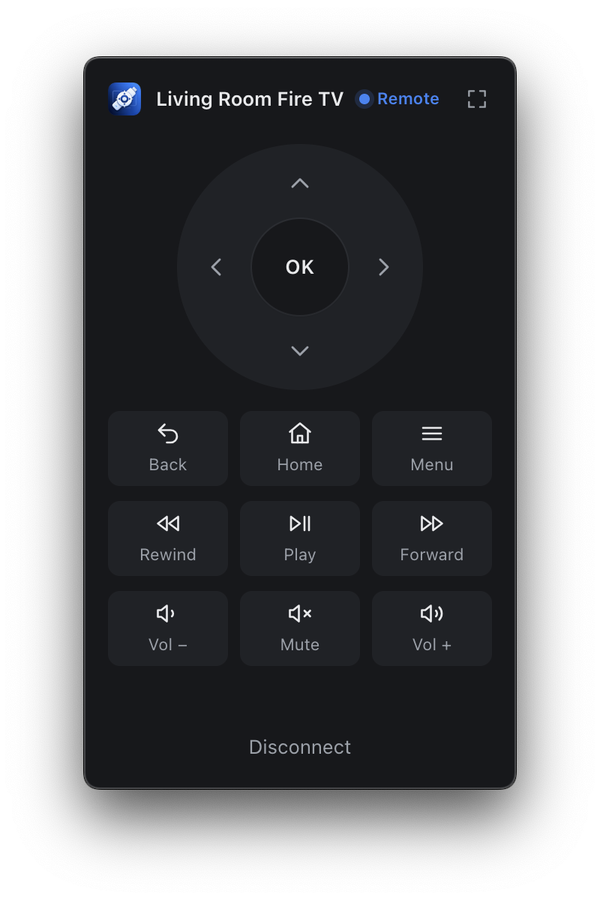
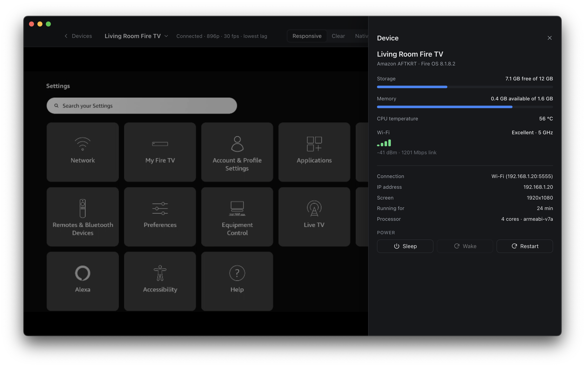
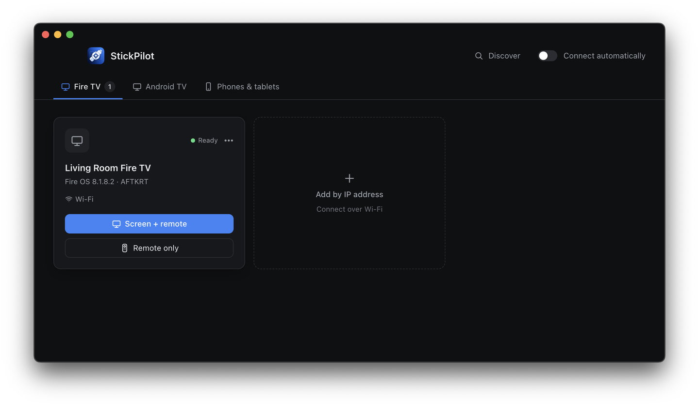

<div align="center">



# StickPilot

**Your Fire TV, on your computer.**<br>
Watch the TV's picture in a window, drive it with a full remote, type with your keyboard and open apps in one click, over Wi-Fi or USB.

[](https://github.com/ShortPlanet3058/StickPilot/releases/latest)


[**Download**](https://github.com/ShortPlanet3058/StickPilot/releases/latest) · [Features](#features) · [Getting started](#getting-started) · [Keyboard shortcuts](#keyboard-shortcuts) · [Build from source](#build-from-source)

<br>



</div>

## Features

<table>
<tr>
<td width="50%" valign="top">

### Screen and remote, side by side
The TV's picture with very little lag, and next to it a remote that has every button Fire OS uses: D-pad, Back, Home, Menu, playback, volume, mute, Settings and Quick settings. Three quality profiles, measured on a Fire TV Stick 4K Max: **Responsive** (30 fps), **Clear** (720p) and **Native** (1080p).

</td>
<td width="50%" valign="top">



</td>
</tr>
<tr>
<td width="50%" valign="top">



</td>
<td width="50%" valign="top">

### Your apps, one click away
The launcher lists the apps installed on the TV, with their real logos. Pin favorites to the remote, search, open or force close.

</td>
</tr>
<tr>
<td width="50%" valign="top">

### Remote only
No picture, no load on the TV: a compact remote window that can stay on top while you work. Your keyboard becomes the TV's keyboard, so arrows move around, Enter selects and typing fills in search boxes, including Amazon's letter-grid searches.

</td>
<td width="50%" valign="top" align="center">



</td>
</tr>
<tr>
<td width="50%" valign="top" align="center">



</td>
<td width="50%" valign="top">

### Always within reach
A mini remote lives in the menu bar (macOS) or the notification area (Windows). **Double-tap Right Shift** anywhere to open it. Closing the window keeps StickPilot running there, and your keyboard's media keys can control the TV too.

</td>
</tr>
<tr>
<td width="50%" valign="top">

### Know your device
Storage, memory, CPU temperature and Wi-Fi signal at a glance, plus Sleep, Wake and Restart.

</td>
<td width="50%" valign="top">



</td>
</tr>
</table>

### And also

- **Wi-Fi made easy:** find TVs on your network with Discover, or switch a USB-connected device to Wi-Fi in one click. Its USB and Wi-Fi connections show as one device.
- **Sound on your computer**, optional: StickPilot warns you and offers to turn it off if the picture starts to lag.
- **Screenshots** at the TV's full resolution, and **recordings** of the screen as MP4.
- **Drag and drop:** drop an APK to install it, or any other file to copy it to the device's Download folder.
- **Not only Fire TV:** Android TV, Google TV, phones and tablets work too, each with a remote that fits them.

## Getting started



1. **Turn on ADB debugging on the TV.** Settings → My Fire TV → Developer options → ADB debugging.
   If Developer options is missing: Settings → My Fire TV → About, then select the device name 7 times.
2. **Install StickPilot** from the [latest release](https://github.com/ShortPlanet3058/StickPilot/releases/latest) (see below).
3. **Find your TV.** Click **Discover**, or **Add by IP address** (the IP is under Settings → My Fire TV → About → Network on the TV).
4. **Allow the connection** on the TV the first time: tick *Always allow from this computer*.
5. Pick **Screen + remote** or **Remote only**. That's it.

<br clear="right">

### Install

| | |
|---|---|
| **macOS** | Open `StickPilot-…-mac-x64.dmg` and drag StickPilot to Applications. The app isn't notarized by Apple, so the first launch is blocked: open **System Settings → Privacy & Security** and click **Open Anyway**. On Apple silicon it runs through Rosetta. |
| **Windows** | Run `StickPilot-…-win-x64-setup.exe`. It installs for your user only (no administrator rights), with Start menu and desktop shortcuts. The installer isn't signed, so SmartScreen may warn you: click **More info → Run anyway**. |

**Permissions on macOS.** StickPilot asks for **Local Network** access, which it needs to reach the TV over Wi-Fi. The Right Shift shortcut and media keys also need **Accessibility** access; StickPilot shows a button that takes you to the right setting.

**USB on Windows** needs the device's ADB driver. Wi-Fi needs nothing extra.

## Keyboard shortcuts

While StickPilot is connected and its window is active, the keyboard drives the TV. Shortcuts use **⌥ Option** on macOS and **Alt** on Windows.

| Keys | Action | Keys | Action |
|---|---|---|---|
| <kbd>←</kbd> <kbd>↑</kbd> <kbd>→</kbd> <kbd>↓</kbd> | Navigate | <kbd>⌥</kbd> <kbd>Space</kbd> | Play / Pause |
| <kbd>Enter</kbd> | OK | <kbd>⌥</kbd> <kbd>←</kbd> / <kbd>→</kbd> | Rewind / Forward |
| <kbd>Esc</kbd> | Back | <kbd>⌥</kbd> <kbd>↑</kbd> / <kbd>↓</kbd> | Volume |
| <kbd>A</kbd>–<kbd>Z</kbd>, <kbd>0</kbd>–<kbd>9</kbd> | Type on the TV | <kbd>⌥</kbd> <kbd>0</kbd> | Mute |
| <kbd>⌥</kbd> <kbd>H</kbd> | Home | <kbd>⌥</kbd> <kbd>A</kbd> | Apps |
| <kbd>⌥</kbd> <kbd>M</kbd> | Menu | <kbd>⌥</kbd> <kbd>U</kbd> | Sound on this computer |
| <kbd>⌥</kbd> <kbd>S</kbd> | Settings | <kbd>⌥</kbd> <kbd>C</kbd> | Screenshot |
| <kbd>⌥</kbd> <kbd>Q</kbd> | Quick settings | <kbd>⌥</kbd> <kbd>⇧</kbd> <kbd>C</kbd> | Record the screen |
| <kbd>⌥</kbd> <kbd>V</kbd> | Paste the clipboard | <kbd>⌥</kbd> <kbd>D</kbd> | Device status |
| <kbd>⌥</kbd> <kbd>F</kbd> | Fullscreen | Right <kbd>⇧</kbd> twice | Mini remote, from anywhere |

## Troubleshooting

<details>
<summary><b>Discover doesn't find my TV</b></summary>

Check that the TV is on (not asleep) and on the same network as the computer, and that ADB debugging is on. You can always add it by IP address. On macOS, make sure StickPilot is allowed under System Settings → Privacy & Security → Local Network.
</details>

<details>
<summary><b>The TV refuses the connection</b></summary>

ADB debugging is off, or the TV hasn't approved this computer yet. Look at the TV for the *Allow USB debugging?* prompt; if you dismissed it, turn ADB debugging off and on again.
</details>

<details>
<summary><b>The picture lags</b></summary>

Use the **Responsive** profile, and turn the sound off: playing the TV's sound on the computer makes the TV work harder. A 5 GHz Wi-Fi network or USB helps too.
</details>

<details>
<summary><b>Double-tap Right Shift does nothing (macOS)</b></summary>

StickPilot needs Accessibility access: System Settings → Privacy & Security → Accessibility, then switch StickPilot on.
</details>

## Build from source

Requires Node.js 22+ and a [scrcpy 4.1](https://github.com/Genymobile/scrcpy/releases/tag/v4.1) download, for its adb and server.

```bash
npm install
npm run vendor      # copies adb + scrcpy-server 4.1 from a local scrcpy download into vendor/
npm start           # builds and opens the app
```

- `npm run vendor -- /path/to/scrcpy-folder` picks another scrcpy download. Without vendor/, the app
  falls back to `STICKPILOT_SCRCPY_DIR` or `~/Documents/tools/scrcpy-macos-x86_64-v4.1`.
- `npm run typecheck` runs the TypeScript compiler.
- `npm run debug` prints the device-side server log.

<details>
<summary><b>Packaging</b></summary>

`npm run dist:mac` builds `release/StickPilot-<version>-mac-x64.dmg` (Intel). adb, the scrcpy
server, the icon helper and the icons are bundled in the app's Resources, so it doesn't need a local
scrcpy download. The app is signed by `scripts/sign-mac.cjs` with a local code-signing certificate named
"StickPilot Local Signing" (self-signed, made in Keychain Access; the longest-valid one is used if
there are several). Its identity stays the same across builds, so macOS keeps StickPilot's
Accessibility and Local Network permissions after updates. Without that certificate the build
falls back to an ad-hoc signature, whose identity changes every build. The app isn't notarized:
a copy downloaded elsewhere needs System Settings → Privacy & Security → Open Anyway the first time.

`npm run dist:win` builds `release/StickPilot-<version>-win-x64-setup.exe` on a Mac too (no Wine
needed). It needs the Windows adb first: `npm run vendor -- ~/Documents/tools/scrcpy-win64-v4.1`
(the official scrcpy Windows release) copies adb.exe and its two DLLs into vendor/win32-x64. The
installer is one click, per user (no administrator rights), into `%LOCALAPPDATA%\Programs\StickPilot`,
with Start menu and desktop shortcuts. Installing, updating and uninstalling stop the adb server that
runs from StickPilot's folder (`scripts/installer.nsh`), and the app stops it when it quits.
On Windows the double-tap Right Shift shortcut uses uiohook-napi's prebuilt binary and the tray
icon sits in the notification area.
</details>

<details>
<summary><b>Driving the app from scripts</b></summary>

`npx electron . --remote-debugging-port=9223` starts the app with the DevTools protocol on.
`node scripts/cdp.mjs eval "<js>"` runs JavaScript in the window, `click <x> <y>` and `keys <key>...`
send real input, `drop <x> <y> <file>` simulates a file drop, and `shot out.png` saves a screenshot.
`CDP_PAGE=tray.html` targets the menu-bar remote. With `--inspect=9229`, `node scripts/main-eval.mjs "<js>"`
evaluates code in the main process (`STICKPILOT_DEBUG=1` also exposes `globalThis.__stickpilot`).
`STICKPILOT_SCREENSHOT=out.png` saves one a few seconds after launch.
</details>

<details>
<summary><b>Project layout</b></summary>

| Path | What it does |
|---|---|
| `src/main/scrcpy.ts` | Client for scrcpy-server 4.1: video stream, remote keys, text, encoder detection |
| `src/main/devices.ts` | Live device list (`adb track-devices`), device identification, Wi-Fi connect, Discover |
| `src/main/profiles.ts` | Quality profiles; the software-encoder set was measured on a Fire TV Stick 4K Max |
| `src/main/recorder.ts` | MP4 recording of the incoming H.264 stream (no re-encoding) |
| `src/main/tray.ts` | Menu-bar / tray icon, mini remote window, media keys |
| `src/main/typing.ts` | Sends typed text as text, or as letter key + OK on Amazon's letter-grid search screens |
| `src/main/main.ts` | Electron main process and IPC |
| `src/renderer/app.ts` | Device screen, player, device switcher, status screens |
| `src/renderer/remote.ts` | Remote layouts per device type (Fire TV, Android TV, phone) |
| `src/renderer/keyboard.ts` | Keyboard routing: keys go to the device while connected; shortcuts use Option/Alt |
| `src/renderer/video.ts` | H.264 decoding with WebCodecs |
| `src/renderer/audio.ts` | Opus decoding and low-latency playback |
| `src/renderer/apps.ts`, `devicePanel.ts`, `tray.ts` | App launcher, device panel, menu-bar remote |
| `helper/` | On-device icon dumper (Java) and the macOS Right Shift helper (Swift) |
| `tools/` | Benchmark and lag probe used to tune the profiles, plus the original shell script |

The server protocol changes between scrcpy versions, so the client is pinned to the bundled
server version (`SERVER_VERSION` in `src/main/paths.ts`).

`assets/logo-source.png` is the logo artwork. `python3 scripts/make-icons.py` (needs Pillow) generates
`assets/StickPilot.icns`, `assets/icon.ico`, `assets/icon.png`, `assets/icon-512.png` and the header
logo `src/renderer/logo.png`. The menu-bar glyph is drawn in code (`src/main/trayIcon.ts`).
</details>

## Credits

StickPilot runs the [scrcpy](https://github.com/Genymobile/scrcpy) server by Genymobile (Apache-2.0,
`vendor/scrcpy-LICENSE`) on the device, and talks to it through adb from Android SDK Platform-Tools.
StickPilot isn't affiliated with Amazon or Google; Fire TV is a trademark of Amazon.
